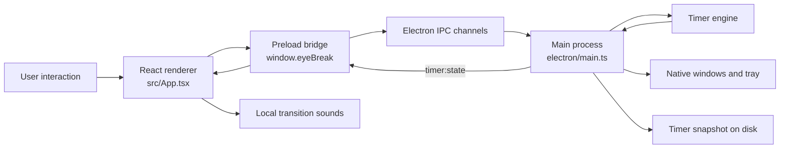

# Electron Desktop Stack

This document explains how Eye Break turns its React web interface into a native
desktop application. It covers Electron, Electron Builder, the main process,
desktop features, IPC, and the current security model.

The descriptions below reflect the current project implementation rather than a
generic Electron example.

## Stack overview

| Technology | Responsibility in Eye Break |
| --- | --- |
| React | Renders the timer, controls, eye visualization, intro, and break screen |
| Vite | Builds the React renderer and Electron entry points |
| TypeScript | Adds compile-time types to the renderer and desktop logic |
| Electron | Provides native windows, tray controls, power events, local storage, and IPC |
| Electron Builder | Packages the compiled project as installable desktop artifacts |
| Electron Fuses | Locks unsafe runtime capabilities in packaged binaries |
| Vitest | Tests timer, persistence, IPC, security, and native overlay behavior |

Key source files:

- [`electron/main.ts`](../electron/main.ts) — Electron main process and native features
- [`electron/preload.ts`](../electron/preload.ts) — restricted renderer bridge
- [`electron/ipc-handlers.ts`](../electron/ipc-handlers.ts) — timer IPC channel registration
- [`electron/timer-engine.ts`](../electron/timer-engine.ts) — timer state machine
- [`electron/rest-overlay.ts`](../electron/rest-overlay.ts) — display selection and native overlay window contract
- [`electron/security.ts`](../electron/security.ts) — trusted renderer URLs and CSP
- [`electron/timer-persistence.ts`](../electron/timer-persistence.ts) — atomic snapshot storage
- [`shared/timer-contract.ts`](../shared/timer-contract.ts) — timer state shared by Electron and React
- [`src/App.tsx`](../src/App.tsx) — React web interface
- [`src/aperture/ApertureApp.tsx`](../src/aperture/ApertureApp.tsx) — active dashboard interface
- [`src/browser-fallback.ts`](../src/browser-fallback.ts) — interactive, in-memory browser preview API
- [`src/CurrentEyeBreakApp.tsx`](../src/CurrentEyeBreakApp.tsx) — preserved dashboard and shared break renderer
- [`src/rest-audio.ts`](../src/rest-audio.ts) — local Web Audio transition cues
- [`src/electron.d.ts`](../src/electron.d.ts) — TypeScript definition for the preload API
- [`build/after-pack.cjs`](../build/after-pack.cjs) — production Electron fuse locking
- [`.github/workflows/ci.yml`](../.github/workflows/ci.yml) — cross-platform quality and dependency-audit automation
- [`package.json`](../package.json) — dependencies, scripts, and packaging configuration

## Overall architecture

Electron separates privileged desktop code from the web interface.



The React layer never imports Node.js, `child_process`, filesystem APIs, or
Electron native modules directly. Native operations are owned by the main
process and exposed through a narrow preload API.

---

## Electron

[Electron](https://www.electronjs.org/docs/latest/tutorial/process-model)
combines Chromium and Node.js so a web interface can run inside a desktop
application while still accessing operating-system features.

Eye Break uses Electron for:

- Creating the main application window
- Creating the full-screen break window
- Keeping the application available through the system tray
- Detecting laptop suspend and resume
- Storing timer data in the application's user-data directory
- Ensuring only one copy of the app runs
- Connecting React controls to native timer logic through IPC

### Electron process model

Eye Break has three relevant execution contexts:

| Context | File | Access level |
| --- | --- | --- |
| Main process | `electron/main.ts` | Full Node.js and Electron native access |
| Preload isolated world | `electron/preload.ts` | Electron bridge access |
| Renderer main world | `src/App.tsx` | Browser and React APIs |

Each `BrowserWindow` gets its own renderer process. Eye Break creates one main
dashboard window and zero or more break windows according to the selected
display mode. Every window uses the same React build; break windows receive a
query parameter:

```text
Main interface:  index.html
Break overlay:   index.html?mode=break
```

During development, these pages come from the Vite development server. In a
packaged application, Electron loads the generated `dist/index.html` file.

### Electron main process

The main process is the native coordinator of Eye Break. It is responsible for
work that a normal website cannot perform safely or consistently.

The main process:

1. Requests the single-instance lock.
2. Waits for Electron to become ready.
3. Locates and restores the saved timer snapshot.
4. Creates the main window and system tray.
5. Restarts the timer interval when required.
6. Registers power-monitor and display events.
7. Registers IPC handlers.
8. Coordinates timer transitions with native rest windows and renderer sounds.
9. Saves timer state before the application quits.

The timer logic itself is kept in `TimerEngine`, rather than being embedded in
the window code. This separation makes the countdown and Auto Mode testable
without launching Electron.

### Relationship between the web UI and desktop application

The React interface is still a web interface. Electron does not replace React;
it hosts the compiled React page inside a native window.

| Web UI responsibility | Desktop responsibility |
| --- | --- |
| Draw the eye and timer | Keep authoritative timer state |
| Display progress | Run timer transitions outside the visible window |
| Render buttons and sliders | Perform requested timer actions |
| Display Auto Mode status | Repeat focus and break cycles |
| Render the break screen | Put the break window above other applications |
| Receive timer state | Persist and restore state |

The desktop timer is authoritative. React displays the state received from
Electron instead of maintaining a separate production timer.

When the same renderer is opened in a normal browser, `window.eyeBreak` is not
available. [`src/browser-fallback.ts`](../src/browser-fallback.ts) supplies an
interactive in-memory timer so the design and primary controls can be previewed.
The native timer, tray, persistence, display management, and launch-at-login
behavior still require Electron.

### Selectable dashboard interface

[`src/ui-variant.ts`](../src/ui-variant.ts) contains the single `ACTIVE_UI`
constant used to select the main-window design:

- `aperture` — the active dashboard
- `eye-break` — the preserved previous dashboard

The native break renderer is shared by both variants, so switching the
dashboard does not fork timer, IPC, persistence, or multi-display behavior.

---

## Electron Builder

[Electron Builder](https://www.electron.build/docs/) converts the compiled
renderer and Electron files into a distributable desktop application.

### Project commands

Every project script is declared in `package.json`:

| Command | Purpose |
| --- | --- |
| `npm run dev` | Start Vite and one Electron development application |
| `npm run dev:web` | Start the interactive browser-only UI preview |
| `npm run build` | Type-check and build the renderer, main process, and preload bundles |
| `npm run check` | Run lint, the complete test suite, and a production build |
| `npm run lint` | Check the source with Oxlint |
| `npm test` | Run all Vitest tests once |
| `npm run test:watch` | Run Vitest in watch mode |
| `npm run test:native-overlays` | Run display-selection and native break-window contract tests |
| `npm run audit:production` | Audit only dependencies shipped in the application |
| `npm run audit:all` | Audit production and development dependencies |
| `npm run preview` | Serve the built renderer for browser inspection |
| `npm run package` | Build an unpacked application directory for local native testing |
| `npm run dist` | Build the configured installer and archive formats |
| `npm run 21st:search -- "<query>"` | Search 21st.dev components through the local CLI |
| `npm run 21st:add -- <component>` | Add a selected 21st.dev component |

`electron-builder --dir` creates an unpacked application without creating the
final installer. This is useful for testing. Running `electron-builder` without
`--dir` creates the configured distributables.

### Current package configuration

The configuration is stored in the `build` property of `package.json`.

| Setting | Current value | Purpose |
| --- | --- | --- |
| `appId` | `com.eyebreak.desktop` | Unique application identifier |
| `productName` | `Eye Break` | User-facing application name |
| `asar` | `true` | Packages application files into `app.asar` |
| `afterPack` | `build/after-pack.cjs` | Locks Electron fuses after packaging |
| `directories.output` | `release` | Places generated packages in `release/` |
| `directories.buildResources` | `build` | Reads packaging assets from `build/` |
| `artifactName` | Product, version, OS, and architecture | Produces predictable filenames |

Only these runtime files are included:

```text
dist/**/*
dist-electron/**/*
public/**/*
package.json
```

Source TypeScript, tests, and development configuration are not required by the
packaged app. Electron Builder's
[application-contents documentation](https://www.electron.build/docs/contents/)
explains file selection and ASAR packaging in more detail.

### Platform targets

| Platform | Configured output |
| --- | --- |
| macOS | DMG and ZIP |
| Windows | NSIS installer |
| Linux | AppImage |

The macOS DMG uses a familiar drag-to-Applications layout. The Windows NSIS
installer is not one-click and permits choosing the installation directory.
The Linux AppImage is a portable single-file application.

### ASAR is packaging, not encryption

`asar: true` groups application code into an archive. This reduces loose files
and discourages casual inspection, but it is not encryption and must not be
treated as a place to hide secrets.

### Signing status

The current local macOS package is unsigned. Public distribution still requires:

- Apple Developer ID signing
- Apple notarization
- Windows code signing for trusted Windows installation
- Release testing on each target operating system

---

## Desktop application features

### Creating Electron windows

Eye Break creates one main `BrowserWindow` and synchronizes break windows with
the selected rest-display mode.

#### Main window

The main window:

- Starts at `1440 × 960`
- Has a minimum size of `1100 × 760`
- Uses the macOS hidden-inset title bar
- Loads the main React interface
- Hides instead of closing during normal use

#### Break window

The break window:

- Has no frame
- Uses an opaque background to avoid white or transparent flashes
- Does not appear in the taskbar
- Cannot be resized or moved
- Covers its assigned display
- Loads the React break-overlay mode
- Remains focusable so Escape and visible rest controls work

### System tray operation

Electron's [`Tray`](https://www.electronjs.org/docs/latest/api/tray/) API keeps
the timer accessible while the main window is hidden.

The tray shows:

- Current state and remaining time
- Open Eye Break
- Start, Pause, or Resume
- Stop cycle
- Auto Mode switch
- Quit Eye Break

The tray tooltip and menu are rebuilt whenever timer state changes, so they stay
synchronized with the React interface.

On macOS, the tray icon is converted to a template image so macOS can adapt it
to light and dark menu bars.

### Launch at login

The main interface includes an optional **Launch at login** switch. In packaged
macOS and Windows builds, the renderer requests the current operating-system
setting through validated IPC and Electron's `app.getLoginItemSettings()`.
Changing the switch calls `app.setLoginItemSettings()` in the main process.

The control is unavailable in development builds so Eye Break never registers
the Electron development executable as a startup item. On macOS, the interface
also reports when the login item requires approval in System Settings.

### Sleep, wake, and restart behavior

The Electron main process listens for `powerMonitor` suspend and resume events.
On suspend it stops the one-second ticker and persists the latest snapshot. On
resume it discards the suspended interval because laptop sleep is not active
screen time:

- Auto Mode starts a fresh full focus period.
- Manual mode resets to Ready and waits for the user to start.

A normal application restart is different from sleep. Active timestamped
timers account for time that passed while the app was closed, paused timers
remain paused, and Auto Mode advances through completed cycles. Corrupted or
incompatible snapshots safely fall back to default state.

### Full-screen break overlay

When focus time finishes, Eye Break:

1. Applies the selected rest-display behavior.
2. Plays the local rest-transition chime at the user's selected volume.
3. Applies the selected rest-screen appearance.
4. Begins the rest countdown.

**No screens** keeps the sound and countdown active without creating an
overlay. **Main display** covers only the operating system's primary display
and leaves other displays usable. **All displays** creates a synchronized
fullscreen rest window for every connected display.

| Rest-display setting | Native break windows created | Behavior |
| --- | ---: | --- |
| No screens | 0 | Sound and countdown continue without covering a display |
| Main display | 1 | Only the operating system's primary display is covered |
| All displays | One per connected display | Every display receives a synchronized fullscreen overlay |

The appearance preference is independent of display placement:

- **Ambient** renders the existing calming gradients, guidance, circular
  countdown, ripples, and rest controls.
- **Pitch black** renders a completely black screen with no visible content.
  The countdown continues internally, the local sound still plays, and Escape
  can still end the rest.
- **Black + timer** renders a black screen with only the centered circular
  countdown and ripple effect.

Both placement and appearance are part of the persisted native timer state.
Changing the appearance is broadcast to every active break window, so all
connected displays remain synchronized.

Ambient mode provides **Extend 20 seconds** and **Skip rest** controls.
Pitch-black modes intentionally omit visible controls; Escape ends the rest in
every mode. Pause, Resume, Stop, and Open Eye Break remain available from the
system tray. All overlays are hidden when the rest ends or the cycle stops.

### Always-on-top priority

Each break window uses:

```ts
window.setAlwaysOnTop(true, 'screen-saver', 1)
window.setVisibleOnAllWorkspaces(true, { visibleOnFullScreen: true })
window.moveTop()
window.show()
```

Electron documents `screen-saver` as a high always-on-top level and permits a
relative level of one on macOS. `moveTop()` moves the window to the top of the
native z-order.

Eye Break tracks displays through Electron's `screen` events. During an active
break, the overlay set is recalculated from the selected mode whenever a
display is attached, removed, or changes metrics. One overlay receives keyboard
focus in all-display mode. Main-display mode does not pull focus back when the
user interacts with an application on another display.

If every break window loses focus while an all-display break is active, Eye
Break brings the overlay set forward again. Timer controls remain available
through the tray.

### No native notifications

Eye Break intentionally does not use Electron's `Notification` API. Finishing a
focus period is communicated through the selected rest-display behavior and
the app's local transition chime. The application therefore does not request or
depend on operating-system notification permission.

### Local transition sounds

The renderer creates dependency-free Web Audio chimes:

- When focus ends and the break begins
- When the break ends

Preferences include a `0–100%` rest-sound slider. The selected level is stored
locally and applied to both transition chimes. Setting the slider to zero mutes
Eye Break without changing system volume or controlling another application.

### Running while the main window is hidden

The normal close event is intercepted:

```ts
mainWindow.on('close', (event) => {
  if (!quitRequested) {
    event.preventDefault()
    mainWindow?.hide()
  }
})
```

Hiding the window does not stop the main process, timer interval, tray, sounds,
or rest windows. The user must choose Quit from the tray or another real quit
action to terminate the application.

### Single-instance application handling

Eye Break calls `app.requestSingleInstanceLock()`.

- The first application process receives the lock and continues.
- A second process fails to receive the lock and quits.
- The first process receives the `second-instance` event and reopens its main
  window.

This prevents two timers, two tray icons, or duplicate break reminders from
running simultaneously. Electron documents this behavior in the
[`app` API](https://www.electronjs.org/docs/latest/api/app).

---

## Electron IPC

### What IPC means

IPC means **inter-process communication**.

Electron's renderer and main process do not share normal function calls or
memory. They communicate using named message channels. Electron describes IPC
as the standard way for a renderer to request native work from the main process:
[Electron IPC guide](https://www.electronjs.org/docs/latest/tutorial/ipc).

### Renderer-to-main communication

Eye Break uses Electron's request-and-response pattern:

```text
React
  → window.eyeBreak.start()
  → ipcRenderer.invoke("timer:start")
  → ipcMain handler
  → TimerEngine.start()
  → updated TimerState
  → React
```

`ipcRenderer.invoke()` returns a promise. The corresponding main-process handler
returns the updated timer state.

### Available IPC channels

Timer channel names are centralized in `TIMER_IPC_CHANNELS`; application
preference channels are centralized in `APP_IPC_CHANNELS`.

| Channel | Direction | Argument | Purpose |
| --- | --- | --- | --- |
| `timer:get-state` | Renderer → main | None | Read current timer state |
| `timer:start` | Renderer → main | None | Start a focus period |
| `timer:pause` | Renderer → main | None | Pause focus or break |
| `timer:resume` | Renderer → main | None | Resume the paused phase |
| `timer:stop` | Renderer → main | None | Reset to idle |
| `timer:rest-now` | Renderer → main | None | Start the rest phase immediately |
| `timer:end-break` | Renderer → main | None | End the current rest and close its overlays |
| `timer:set-remaining` | Renderer → main | Milliseconds | Adjust remaining time |
| `timer:set-break-duration` | Renderer → main | Milliseconds | Change rest duration |
| `timer:set-auto-mode` | Renderer → main | Boolean | Enable or disable repetition |
| `timer:set-rest-overlay-mode` | Renderer → main | Display mode | Choose no overlay, primary display, or all displays |
| `timer:set-rest-appearance-mode` | Renderer → main | Appearance mode | Choose Ambient, Pitch black, or Black + timer |
| `timer:state` | Main → renderer | `TimerState` | Push state changes to windows |
| `app:get-launch-at-login` | Renderer → main | None | Read the native startup preference |
| `app:set-launch-at-login` | Renderer → main | Boolean | Enable or disable launch at login |

The two `app:*` channels use a separate explicit allowlist because launch at
login is an application preference rather than a timer-engine action. They
receive the same sender and argument validation as timer channels.

### Main-to-renderer state updates

The main process sends `timer:state` to both the dashboard and break renderer:

```ts
target.webContents.send(TIMER_IPC_CHANNELS.stateChanged, timerState)
```

The preload script subscribes to that channel and forwards only the state value
to React. It returns an unsubscribe function so listeners are removed when the
React component unmounts.

### Preload API

The preload script publishes one controlled global:

```ts
window.eyeBreak
```

Its complete public API is:

| Method | Argument | Result and purpose |
| --- | --- | --- |
| `getState()` | None | Returns the current `TimerState` |
| `start()` | None | Starts a focus period |
| `pause()` | None | Pauses the current focus or rest phase |
| `resume()` | None | Resumes the paused phase |
| `stop()` | None | Stops the cycle and returns it to idle |
| `restNow()` | None | Starts a rest immediately |
| `endBreak()` | None | Ends the current rest and closes its overlays |
| `setRemaining(remainingMs)` | Milliseconds | Adjusts the current countdown |
| `setBreakDuration(durationMs)` | Milliseconds | Changes the configured rest duration |
| `setAutoMode(enabled)` | Boolean | Enables or disables repeating cycles |
| `setRestOverlayMode(mode)` | `none`, `primary-display`, or `all-displays` | Changes native overlay placement |
| `setRestAppearanceMode(mode)` | `ambient`, `black`, or `black-timer` | Changes the rest-screen appearance |
| `getLaunchAtLogin()` | None | Reads native launch-at-login support and state |
| `setLaunchAtLogin(enabled)` | Boolean | Changes the native startup preference |
| `onStateChange(callback)` | State listener | Subscribes to pushed timer updates and resolves to an unsubscribe function |

React receives TypeScript support for this API from `src/electron.d.ts`.

### Preload isolation boundary

Every renderer window sets:

```ts
contextIsolation: true
```

Context isolation places the preload script and the React page in separate
JavaScript contexts. The preload script uses
[`contextBridge.exposeInMainWorld`](https://www.electronjs.org/docs/latest/api/context-bridge)
to expose the narrow `eyeBreak` API.

The raw `ipcRenderer` object is never exposed to React.

### Implemented IPC boundary security

These controls are implemented in the current code; they are not remaining
hardening work:

- Channel names are explicit and centralized.
- The renderer cannot choose arbitrary channel names.
- The renderer cannot access the raw `ipcRenderer`.
- The renderer cannot access Node.js or filesystem APIs.
- Timer actions are a small allowlist.
- Numeric timer operations reject non-finite values in `TimerEngine`.
- Media and shell commands are not exposed through IPC.

Every timer and application-preference handler validates its sender before
invoking an action. A sender is accepted only when:

1. Its `webContents.id` belongs to the current dashboard or an active break
   window.
2. The request comes from that window's top-level main frame.
3. The frame URL matches the trusted development origin or packaged renderer
   file.

Mutable arguments are validated at the IPC boundary for type, finite numeric
value, range, allowed increment, or exact allowed string value. Unexpected
windows, subframes, untrusted URLs, and malformed payloads are rejected before
they can reach the timer or startup-preference actions.

[`tests/ipc-handlers.test.ts`](../tests/ipc-handlers.test.ts) covers sender
rejection, malformed timer payloads, invalid display and appearance modes, and
invalid launch-at-login values. [`tests/security.test.ts`](../tests/security.test.ts)
covers trusted renderer URL rules and the production CSP.

---

## Security

Electron applications contain both web content and native privileges. The main
security goal is to prevent renderer content from gaining unrestricted access
to Node.js, the filesystem, processes, or operating-system commands.

Electron maintains an official
[security checklist](https://www.electronjs.org/docs/latest/tutorial/security).

### Current security status

| Control | Status | Notes |
| --- | --- | --- |
| Context isolation | Enabled | Enabled on both windows |
| Raw Electron API in React | Not exposed | Only `window.eyeBreak` is exposed |
| Node integration | Disabled | Explicitly set to `false` on every window |
| Renderer sandbox | Enabled | Explicitly set to `true` on every window |
| Content Security Policy | Configured | Production loads only bundled resources |
| Remote production content | Not loaded | Production loads local bundled files |
| IPC allowlist | Implemented | Fixed timer channels |
| IPC sender validation | Implemented | Requires a trusted top-level app frame |
| IPC argument validation | Implemented | Types and ranges checked at every boundary |
| Navigation and new windows | Restricted | Untrusted navigation, webviews, and popups are denied |
| Local timer storage | Plain JSON | Contains timer state, not credentials |
| Runtime shell execution | Not used | No shell or media commands are executed |

### Electron sandboxing

Chromium's sandbox limits renderer access to operating-system resources. When a
sandboxed renderer needs privileged work, it must ask the main process through
IPC.

Every renderer explicitly uses:

```ts
sandbox: true
nodeIntegration: false
contextIsolation: true
```

Native work remains in the main process and is exposed only through the narrow
preload bridge. The bundled preload and all timer controls are compiled and
tested with sandboxing enabled.

See Electron's
[process-sandboxing guide](https://www.electronjs.org/docs/latest/tutorial/sandbox).

### Context isolation

Context isolation is enabled and should remain enabled.

It prevents page scripts from directly changing or reading the JavaScript
environment used by the preload script. The context bridge provides a deliberate
boundary between React and Electron privileges.

Context isolation is not a replacement for sandboxing. Both protections should
be enabled.

### Content Security Policy

A Content Security Policy restricts the scripts, styles, fonts, images, and
network origins a renderer may load. It reduces the impact of cross-site
scripting and content injection.

Eye Break installs a CSP response header before creating renderer windows.
Production uses:

```text
default-src 'self';
script-src 'self';
style-src 'self' 'unsafe-inline';
img-src 'self' data:;
font-src 'self';
connect-src 'self';
object-src 'none';
base-uri 'none';
frame-src 'none';
frame-ancestors 'none';
form-action 'none';
```

The inline-style allowance supports the timer's dynamic progress visuals.
Scripts, fonts, and network connections remain limited to the app itself.
Lora and Raleway are bundled as local WOFF2 assets. Development receives a
separate policy limited to the local Vite origin and its hot-module-replacement
WebSocket.

### Safe IPC exposure

The preload bridge should expose one method per allowed action:

```ts
start: () => ipcRenderer.invoke('timer:start')
```

It should not expose generic capabilities such as:

```ts
// Do not expose APIs like these:
sendAnyChannel(channel, value)
runCommand(command)
readFile(path)
openUrl(url)
```

Generic privileged functions make it difficult to enforce security at the
process boundary.

### Local data security

Timer data is stored at:

```text
<Electron userData>/eye-break-data/timer-state.json
```

Electron recommends an app-specific subdirectory inside `userData` to avoid
conflicts with Chromium-managed folders.

The file contains:

- Timer phase and remaining time
- Focus and break durations
- Auto Mode state
- Rest-display placement and appearance preferences
- Completed-session count
- Accumulated focus and eye-rest time
- Timestamps required for restoration

It does not contain passwords, authentication tokens, payment data, or the
21st.dev API key.

Snapshots are written through a temporary file and renamed into place. This
reduces the chance of leaving partially written JSON after interruption.

The snapshot is plain JSON and is not encrypted. Sensitive data should not be
added to this file without a separate security design.

Two renderer-only preferences use Chromium `localStorage`:

- `eye-break-rest-volume` — the local chime volume
- `eye-break-rest-seconds` — the preferred rest duration used by the UI

These values contain no credentials or personal content. The authoritative
desktop timer snapshot still contains the current break duration so native
windows remain synchronized.

### No media automation or shell control

Eye Break does not control Spotify, Apple Music, browser playback, or other
media applications. It does not run AppleScript, `playerctl`, media-key
commands, or shell commands when a rest starts. Therefore the application does
not need macOS Automation permission for media control.

The project must continue to avoid:

- Passing renderer values into executable names
- Executing arbitrary channel payloads
- Using `exec()` for dynamically built command strings
- Exposing command execution through the preload API

### Locked Electron fuses

Electron Builder runs `build/after-pack.cjs` against every packaged binary. The
hook uses the official `@electron/fuses` package to:

- Disable `ELECTRON_RUN_AS_NODE`
- Disable `NODE_OPTIONS`
- Disable command-line Node inspection arguments
- Enable cookie encryption
- Validate the embedded ASAR
- Require application code to load from the ASAR
- Disable extra `file://` privileges
- Enable the browser-specific V8 snapshot and WebAssembly trap handlers

Fuse locking happens after packaging and before code signing. The macOS hook
resets the ad-hoc signature after modifying the binary so the final application
can be signed normally.

### Dependency audits

Run both audit levels before a release:

```bash
npm audit --omit=dev
npm audit
```

The production dependency audit is the release-blocking result because those
packages ship in the application. Development-only findings must still be
reviewed because packaging tools process project files during a trusted build.

---

## Recommended security roadmap

Complete these items before public distribution:

1. Add Apple and Windows code signing.
2. Manually verify real multi-monitor hardware on each supported operating system.
3. Keep Electron, Electron Builder, and development-tool audit findings reviewed and updated.

## Continuous integration

[`.github/workflows/ci.yml`](../.github/workflows/ci.yml) runs on pushes, pull
requests, and manual dispatches. Its quality matrix covers Ubuntu, macOS, and
Windows with Node.js 22. Every runner installs the locked dependency graph and
runs:

- Oxlint
- The complete Vitest suite
- The focused native-overlay contract suite
- The renderer, Electron main-process, and preload build

A separate Ubuntu job runs both security audits. The packaged-dependency audit
is blocking. The complete development-toolchain audit is non-blocking but
produces a visible warning and workflow summary when Electron Builder's
transitive development dependencies report advisories.

## Related automated tests

| Test file | Coverage |
| --- | --- |
| [`tests/timer-engine.test.ts`](../tests/timer-engine.test.ts) | Timer, Auto Mode, restore, and wake behavior |
| [`tests/ipc-handlers.test.ts`](../tests/ipc-handlers.test.ts) | IPC sender and argument validation |
| [`tests/security.test.ts`](../tests/security.test.ts) | Trusted renderer URLs and production CSP |
| [`tests/timer-persistence.test.ts`](../tests/timer-persistence.test.ts) | Atomic save, restore, and corrupted data |
| [`tests/rest-overlay.test.ts`](../tests/rest-overlay.test.ts) | Display-mode selection |
| [`tests/rest-overlay-native.test.ts`](../tests/rest-overlay-native.test.ts) | Secure window options, fullscreen calls, multi-display synchronization, and cleanup |
| [`tests/rest-overlay-render-state.test.ts`](../tests/rest-overlay-render-state.test.ts) | Break-window hydration, phase rejection, duration clamping, and renderer-side countdown projection |
| [`tests/rest-audio.test.ts`](../tests/rest-audio.test.ts) | Volume normalization and local preference persistence |
| [`tests/browser-fallback.test.ts`](../tests/browser-fallback.test.ts) | Interactive browser-preview controls and preferences |

Run all tests with:

```bash
npm test
```

Run only the native display contract tests with:

```bash
npm run test:native-overlays
```
