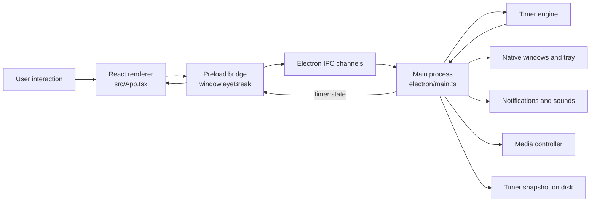

# Electron Desktop Stack

This document explains how Eye Break turns its React web interface into a native
desktop application. It covers Electron, Electron Builder, the main process,
desktop features, background-media control, IPC, and the current security model.

The descriptions below reflect the current project implementation rather than a
generic Electron example.

## Stack overview

| Technology | Responsibility in Eye Break |
| --- | --- |
| React | Renders the timer, controls, eye visualization, intro, and break screen |
| Vite | Builds the React renderer and Electron entry points |
| TypeScript | Adds compile-time types to the renderer and desktop logic |
| Electron | Provides native windows, tray controls, notifications, sounds, power events, and IPC |
| Electron Builder | Packages the compiled project as installable desktop artifacts |
| Media controller | Requests supported background players to pause when focus time ends |
| Vitest | Tests timer, persistence, IPC, sleep/wake, and media-control logic |

Key source files:

- [`electron/main.ts`](../electron/main.ts) — Electron main process and native features
- [`electron/preload.ts`](../electron/preload.ts) — restricted renderer bridge
- [`electron/ipc-handlers.ts`](../electron/ipc-handlers.ts) — timer IPC channel registration
- [`electron/media-controller.ts`](../electron/media-controller.ts) — background-media pausing
- [`electron/timer-engine.ts`](../electron/timer-engine.ts) — timer state machine
- [`src/App.tsx`](../src/App.tsx) — React web interface
- [`src/electron.d.ts`](../src/electron.d.ts) — TypeScript definition for the preload API
- [`package.json`](../package.json) — dependencies, scripts, and packaging configuration

## Overall architecture

Electron separates privileged desktop code from the web interface.



The React layer never imports Node.js, `child_process`, filesystem APIs, or
Electron native modules directly. Native operations are owned by the main
process and exposed through a narrow preload API.

---

## Electron

[Electron](https://www.electronjs.org/docs/latest/tutorial/process-model)
combines Chromium and Node.js so a web interface can run inside a desktop
application while still accessing operating-system features.

Eye Break uses Electron for:

- Creating the main application window
- Creating the full-screen break window
- Keeping the application available through the system tray
- Displaying native notifications
- Playing system alert sounds
- Detecting laptop suspend and resume
- Storing timer data in the application's user-data directory
- Ensuring only one copy of the app runs
- Connecting React controls to native timer logic through IPC

### Electron process model

Eye Break has three relevant execution contexts:

| Context | File | Access level |
| --- | --- | --- |
| Main process | `electron/main.ts` | Full Node.js and Electron native access |
| Preload isolated world | `electron/preload.ts` | Electron bridge access |
| Renderer main world | `src/App.tsx` | Browser and React APIs |

Each `BrowserWindow` gets its own renderer process. Eye Break creates a main
window for the dashboard and a second renderer window for the break overlay.
Both renderer windows use the same React build but receive a different query
parameter:

```text
Main interface:  index.html
Break overlay:   index.html?mode=break
```

During development, these pages come from the Vite development server. In a
packaged application, Electron loads the generated `dist/index.html` file.

### Electron main process

The main process is the native coordinator of Eye Break. It is responsible for
work that a normal website cannot perform safely or consistently.

The main process:

1. Requests the single-instance lock.
2. Waits for Electron to become ready.
3. Locates and restores the saved timer snapshot.
4. Creates the main window and system tray.
5. Restarts the timer interval when required.
6. Registers power-monitor and display events.
7. Registers IPC handlers.
8. Coordinates timer transitions with native UI and media controls.
9. Saves timer state before the application quits.

The timer logic itself is kept in `TimerEngine`, rather than being embedded in
the window code. This separation makes the countdown and Auto Mode testable
without launching Electron.

### Relationship between the web UI and desktop application

The React interface is still a web interface. Electron does not replace React;
it hosts the compiled React page inside a native window.

| Web UI responsibility | Desktop responsibility |
| --- | --- |
| Draw the eye and timer | Keep authoritative timer state |
| Display progress | Run timer transitions outside the visible window |
| Render buttons and sliders | Perform requested timer actions |
| Display Auto Mode status | Repeat focus and break cycles |
| Render the break screen | Put the break window above other applications |
| Receive timer state | Persist and restore state |

The desktop timer is authoritative. React displays the state received from
Electron instead of maintaining a separate production timer.

When the same renderer is opened in a normal browser, `window.eyeBreak` is not
available. `App.tsx` currently supplies a static browser fallback so the design
can be previewed, but the full native timer, tray, notifications, persistence,
and media controls require Electron.

---

## Electron Builder

[Electron Builder](https://www.electron.build/docs/) converts the compiled
renderer and Electron files into a distributable desktop application.

### Project commands

```bash
# Compile React and Electron
npm run build

# Produce an unpacked app directory for local testing
npm run package

# Produce platform-specific installers and archives
npm run dist
```

`electron-builder --dir` creates an unpacked application without creating the
final installer. This is useful for testing. Running `electron-builder` without
`--dir` creates the configured distributables.

### Current package configuration

The configuration is stored in the `build` property of `package.json`.

| Setting | Current value | Purpose |
| --- | --- | --- |
| `appId` | `com.eyebreak.desktop` | Unique application identifier |
| `productName` | `Eye Break` | User-facing application name |
| `asar` | `true` | Packages application files into `app.asar` |
| `directories.output` | `release` | Places generated packages in `release/` |
| `directories.buildResources` | `build` | Reads packaging assets from `build/` |
| `artifactName` | Product, version, OS, and architecture | Produces predictable filenames |

Only these runtime files are included:

```text
dist/**/*
dist-electron/**/*
public/**/*
package.json
```

Source TypeScript, tests, and development configuration are not required by the
packaged app. Electron Builder's
[application-contents documentation](https://www.electron.build/docs/contents/)
explains file selection and ASAR packaging in more detail.

### Platform targets

| Platform | Configured output |
| --- | --- |
| macOS | DMG and ZIP |
| Windows | NSIS installer |
| Linux | AppImage |

The macOS DMG uses a familiar drag-to-Applications layout. The Windows NSIS
installer is not one-click and permits choosing the installation directory.
The Linux AppImage is a portable single-file application.

### ASAR is packaging, not encryption

`asar: true` groups application code into an archive. This reduces loose files
and discourages casual inspection, but it is not encryption and must not be
treated as a place to hide secrets.

### Signing status

The current local macOS package is unsigned. Public distribution still requires:

- Apple Developer ID signing
- Apple notarization
- Windows code signing for trusted Windows installation
- Release testing on each target operating system

---

## Desktop application features

### Creating Electron windows

Eye Break creates one main `BrowserWindow` and synchronizes break windows with
the selected rest-display mode.

#### Main window

The main window:

- Starts at `1440 × 960`
- Has a minimum size of `1100 × 760`
- Uses the macOS hidden-inset title bar
- Loads the main React interface
- Hides instead of closing during normal use

#### Break window

The break window:

- Has no frame
- Uses a transparent background
- Does not appear in the taskbar
- Cannot be resized or moved
- Covers its assigned display
- Loads the React break-overlay mode
- Remains focusable so its Pause and Stop controls work

### System tray operation

Electron's [`Tray`](https://www.electronjs.org/docs/latest/api/tray/) API keeps
the timer accessible while the main window is hidden.

The tray shows:

- Current state and remaining time
- Open Eye Break
- Start, Pause, or Resume
- Stop cycle
- Auto Mode switch
- Quit Eye Break

The tray tooltip and menu are rebuilt whenever timer state changes, so they stay
synchronized with the React interface.

On macOS, the tray icon is converted to a template image so macOS can adapt it
to light and dark menu bars.

### Launch at login

The main interface includes an optional **Launch at login** switch. In packaged
macOS and Windows builds, the renderer requests the current operating-system
setting through validated IPC and Electron's `app.getLoginItemSettings()`.
Changing the switch calls `app.setLoginItemSettings()` in the main process.

The control is unavailable in development builds so Eye Break never registers
the Electron development executable as a startup item. On macOS, the interface
also reports when the login item requires approval in System Settings.

### Full-screen break overlay

When focus time finishes, Eye Break:

1. Requests supported media players to pause.
2. Plays the system alert sound.
3. Applies the selected rest-display behavior.
4. Sends a native notification.
5. Begins the rest countdown.

**No screens** keeps the sound and countdown active without creating an
overlay. **Main display** covers only the operating system's primary display
and leaves other displays usable. **All displays** creates a synchronized
fullscreen rest window for every connected display.

The break overlay has Pause and Stop controls. It is hidden when the rest
period ends or the user stops the cycle.

### Always-on-top priority

Each break window uses:

```ts
window.setAlwaysOnTop(true, 'screen-saver', 1)
window.setVisibleOnAllWorkspaces(true, { visibleOnFullScreen: true })
window.moveTop()
window.show()
```

Electron documents `screen-saver` as a high always-on-top level and permits a
relative level of one on macOS. `moveTop()` moves the window to the top of the
native z-order.

Eye Break tracks displays through Electron's `screen` events. During an active
break, the overlay set is recalculated from the selected mode whenever a
display is attached, removed, or changes metrics. One overlay receives keyboard
focus in all-display mode. Main-display mode does not pull focus back when the
user interacts with an application on another display.

If every break window loses focus while a break is active, Eye Break brings the
overlay set forward again. The user can still Pause or Stop from any overlay.

### Native notifications

At the end of focus time, Eye Break checks
`Notification.isSupported()` and creates an operating-system notification.

The message includes the selected break duration. The notification itself is
silent because Eye Break separately calls `shell.beep()` for a consistent
transition sound.

Notification display can still depend on the user's operating-system permission
and notification settings.

### System sounds

`shell.beep()` is called:

- When focus ends and the break begins
- When the break ends

The project does not currently provide sound selection or volume controls.

### Running while the main window is hidden

The normal close event is intercepted:

```ts
mainWindow.on('close', (event) => {
  if (!quitRequested) {
    event.preventDefault()
    mainWindow?.hide()
  }
})
```

Hiding the window does not stop the main process, timer interval, tray, or native
notifications. The user must choose Quit from the tray or another real quit
action to terminate the application.

### Single-instance application handling

Eye Break calls `app.requestSingleInstanceLock()`.

- The first application process receives the lock and continues.
- A second process fails to receive the lock and quits.
- The first process receives the `second-instance` event and reopens its main
  window.

This prevents two timers, two tray icons, or duplicate break reminders from
running simultaneously. Electron documents this behavior in the
[`app` API](https://www.electronjs.org/docs/latest/api/app).

---

## Background-media handling

Background-media handling lives in
[`electron/media-controller.ts`](../electron/media-controller.ts).

It is triggered only when a focus period ends. A missing player or failed media
command is deliberately prevented from blocking the alert, notification, or
break overlay.

### Pausing Apple Music and Spotify

On macOS, Eye Break runs static AppleScript commands through `osascript`.

Each command:

1. Checks whether the application is already running.
2. Checks whether its player state is `playing`.
3. Calls the application's explicit `pause` command.

Eye Break currently supports:

- Apple Music
- Spotify

The scripts do not launch either player when it is absent.

### Linux MPRIS support

On Linux, Eye Break calls:

```bash
playerctl --all-players pause
```

`playerctl` communicates with compatible players through MPRIS. The
[MPRIS specification](https://specifications.freedesktop.org/mpris/latest/Player_Interface.html)
defines `Pause` as an idempotent action: already-paused media stays paused.

`playerctl` must be installed and the media player must expose an MPRIS session.

### Why explicit Pause is safer than Play/Pause

An explicit Pause action has only one intended result:

```text
Playing → Paused
Paused  → Paused
Stopped → Stopped
```

A Play/Pause toggle can do the opposite of what Eye Break needs:

```text
Playing → Paused
Paused  → Playing
Stopped → Possibly playing
```

Therefore Eye Break never sends a blind media-key toggle. This prevents the
break reminder from accidentally starting music that was already paused.

### Unsupported media applications

Electron does not provide a universal cross-platform API for pausing every
application's audio.

The current controller does not guarantee control over:

- Media playing inside arbitrary browser tabs
- Games
- Video-conference applications
- Players without AppleScript or MPRIS control
- Protected or remote playback sessions
- Windows media sessions, which are not implemented yet

The break overlay and notification still work when media cannot be paused.

### macOS automation permissions

The first time Eye Break controls Apple Music or Spotify, macOS may request
Automation permission. The user controls this permission in:

```text
System Settings → Privacy & Security → Automation
```

If permission is denied, the media command fails silently and the break flow
continues. Eye Break does not attempt to bypass macOS privacy controls.

### Error handling when a player is unavailable

Media commands run independently with `Promise.all`. Each command catches its
own failure.

This design ensures:

- Spotify being absent does not prevent Apple Music from pausing.
- A denied permission does not prevent the overlay.
- A missing Linux `playerctl` command does not crash Electron.
- Media-control latency does not delay the break screen.

---

## Electron IPC

### What IPC means

IPC means **inter-process communication**.

Electron's renderer and main process do not share normal function calls or
memory. They communicate using named message channels. Electron describes IPC
as the standard way for a renderer to request native work from the main process:
[Electron IPC guide](https://www.electronjs.org/docs/latest/tutorial/ipc).

### Renderer-to-main communication

Eye Break uses Electron's request-and-response pattern:

```text
React
  → window.eyeBreak.start()
  → ipcRenderer.invoke("timer:start")
  → ipcMain handler
  → TimerEngine.start()
  → updated TimerState
  → React
```

`ipcRenderer.invoke()` returns a promise. The corresponding main-process handler
returns the updated timer state.

### Available timer channels

All channel names are centralized in `TIMER_IPC_CHANNELS`.

| Channel | Direction | Argument | Purpose |
| --- | --- | --- | --- |
| `timer:get-state` | Renderer → main | None | Read current timer state |
| `timer:start` | Renderer → main | None | Start a focus period |
| `timer:pause` | Renderer → main | None | Pause focus or break |
| `timer:resume` | Renderer → main | None | Resume the paused phase |
| `timer:stop` | Renderer → main | None | Reset to idle |
| `timer:rest-now` | Renderer → main | None | Start the rest phase immediately |
| `timer:end-break` | Renderer → main | None | End the current rest and close its overlays |
| `timer:set-remaining` | Renderer → main | Milliseconds | Adjust remaining time |
| `timer:set-break-duration` | Renderer → main | Milliseconds | Change rest duration |
| `timer:set-auto-mode` | Renderer → main | Boolean | Enable or disable repetition |
| `timer:set-rest-overlay-mode` | Renderer → main | Display mode | Choose no overlay, primary display, or all displays |
| `timer:state` | Main → renderer | `TimerState` | Push state changes to windows |

### Main-to-renderer state updates

The main process sends `timer:state` to both the dashboard and break renderer:

```ts
target.webContents.send(TIMER_IPC_CHANNELS.stateChanged, timerState)
```

The preload script subscribes to that channel and forwards only the state value
to React. It returns an unsubscribe function so listeners are removed when the
React component unmounts.

### Preload API

The preload script publishes one controlled global:

```ts
window.eyeBreak
```

Its public methods are:

```ts
getState()
start()
pause()
resume()
stop()
setRemaining(remainingMs)
setBreakDuration(durationMs)
setAutoMode(enabled)
onStateChange(callback)
```

React receives TypeScript support for this API from `src/electron.d.ts`.

### Context isolation

Both windows set:

```ts
contextIsolation: true
```

Context isolation places the preload script and the React page in separate
JavaScript contexts. The preload script uses
[`contextBridge.exposeInMainWorld`](https://www.electronjs.org/docs/latest/api/context-bridge)
to expose the narrow `eyeBreak` API.

The raw `ipcRenderer` object is never exposed to React.

### IPC security

Positive properties of the current IPC design:

- Channel names are explicit and centralized.
- The renderer cannot choose arbitrary channel names.
- The renderer cannot access the raw `ipcRenderer`.
- The renderer cannot access Node.js or filesystem APIs.
- Timer actions are a small allowlist.
- Numeric timer operations reject non-finite values in `TimerEngine`.
- Media and shell commands are not exposed through IPC.

Remaining hardening work:

- Validate every IPC argument at the handler boundary, not only in the engine.
- Validate the sender frame and expected renderer origin.
- Reject requests from unexpected windows.
- Add negative tests for malformed IPC payloads.

---

## Security

Electron applications contain both web content and native privileges. The main
security goal is to prevent renderer content from gaining unrestricted access
to Node.js, the filesystem, processes, or operating-system commands.

Electron maintains an official
[security checklist](https://www.electronjs.org/docs/latest/tutorial/security).

### Current security status

| Control | Status | Notes |
| --- | --- | --- |
| Context isolation | Enabled | Enabled on both windows |
| Raw Electron API in React | Not exposed | Only `window.eyeBreak` is exposed |
| Node integration | Disabled | Explicitly set to `false` on every window |
| Renderer sandbox | Enabled | Explicitly set to `true` on every window |
| Content Security Policy | Configured | Production loads only bundled resources |
| Remote production content | Not loaded | Production loads local bundled files |
| IPC allowlist | Implemented | Fixed timer channels |
| IPC sender validation | Implemented | Requires a trusted top-level app frame |
| IPC argument validation | Implemented | Types and ranges checked at every boundary |
| Navigation and new windows | Restricted | Untrusted navigation, webviews, and popups are denied |
| Local timer storage | Plain JSON | Contains timer state, not credentials |
| Shell command construction | Static and argument-based | No user input reaches commands |

### Electron sandboxing

Chromium's sandbox limits renderer access to operating-system resources. When a
sandboxed renderer needs privileged work, it must ask the main process through
IPC.

Every renderer explicitly uses:

```ts
sandbox: true
nodeIntegration: false
contextIsolation: true
```

Native work remains in the main process and is exposed only through the narrow
preload bridge. The bundled preload and all timer controls are compiled and
tested with sandboxing enabled.

See Electron's
[process-sandboxing guide](https://www.electronjs.org/docs/latest/tutorial/sandbox).

### Context isolation

Context isolation is enabled and should remain enabled.

It prevents page scripts from directly changing or reading the JavaScript
environment used by the preload script. The context bridge provides a deliberate
boundary between React and Electron privileges.

Context isolation is not a replacement for sandboxing. Both protections should
be enabled.

### Content Security Policy

A Content Security Policy restricts the scripts, styles, fonts, images, and
network origins a renderer may load. It reduces the impact of cross-site
scripting and content injection.

Eye Break installs a CSP response header before creating renderer windows.
Production uses:

```text
default-src 'self';
script-src 'self';
style-src 'self' 'unsafe-inline';
img-src 'self' data:;
font-src 'self';
connect-src 'self';
object-src 'none';
base-uri 'none';
frame-ancestors 'none';
```

The inline-style allowance supports the timer's dynamic progress visuals.
Scripts, fonts, and network connections remain limited to the app itself.
Lora and Raleway are bundled as local WOFF2 assets. Development receives a
separate policy limited to the local Vite origin and its hot-module-replacement
WebSocket.

### Safe IPC exposure

The preload bridge should expose one method per allowed action:

```ts
start: () => ipcRenderer.invoke('timer:start')
```

It should not expose generic capabilities such as:

```ts
// Do not expose APIs like these:
sendAnyChannel(channel, value)
runCommand(command)
readFile(path)
openUrl(url)
```

Generic privileged functions make it difficult to enforce security at the
process boundary.

### Local data security

Timer data is stored at:

```text
<Electron userData>/eye-break-data/timer-state.json
```

Electron recommends an app-specific subdirectory inside `userData` to avoid
conflicts with Chromium-managed folders.

The file contains:

- Timer phase and remaining time
- Focus and break durations
- Auto Mode state
- Completed-session count
- Timestamps required for restoration

It does not contain passwords, authentication tokens, payment data, or the
21st.dev API key.

Snapshots are written through a temporary file and renamed into place. This
reduces the chance of leaving partially written JSON after interruption.

The snapshot is plain JSON and is not encrypted. Sensitive data should not be
added to this file without a separate security design.

### AppleScript permissions

AppleScript is used only to request Pause from Apple Music and Spotify.

Security properties:

- Scripts are static application code.
- No renderer or user text is inserted into a script.
- macOS controls Automation permission.
- Permission failure is treated as non-fatal.
- The application does not request broader Accessibility control.

Users can revoke Automation access at any time in macOS System Settings.

### Avoiding arbitrary shell commands

The media controller uses Node's `execFile()`:

```ts
execFile('osascript', ['-e', staticScript])
```

This is safer than constructing a shell command string because `execFile`
executes a specific binary with an argument array and does not require shell
parsing.

The project must continue to avoid:

- Passing renderer values into executable names
- Concatenating user input into AppleScript
- Executing arbitrary channel payloads
- Using `exec()` for dynamically built command strings
- Exposing command execution through the preload API

---

## Recommended security roadmap

Complete these items before public distribution:

1. Review and lock Electron fuses for distribution builds.
2. Add Apple and Windows code signing.
3. Add OS-level multi-display integration tests.
4. Keep Electron and Electron Builder updated.

## Related automated tests

| Test file | Coverage |
| --- | --- |
| [`tests/timer-engine.test.ts`](../tests/timer-engine.test.ts) | Timer, Auto Mode, restore, and wake behavior |
| [`tests/ipc-handlers.test.ts`](../tests/ipc-handlers.test.ts) | IPC sender and argument validation |
| [`tests/security.test.ts`](../tests/security.test.ts) | Trusted renderer URLs and production CSP |
| [`tests/media-controller.test.ts`](../tests/media-controller.test.ts) | Safe Pause commands and error handling |
| [`tests/timer-persistence.test.ts`](../tests/timer-persistence.test.ts) | Atomic save, restore, and corrupted data |

Run all tests with:

```bash
npm test
```
